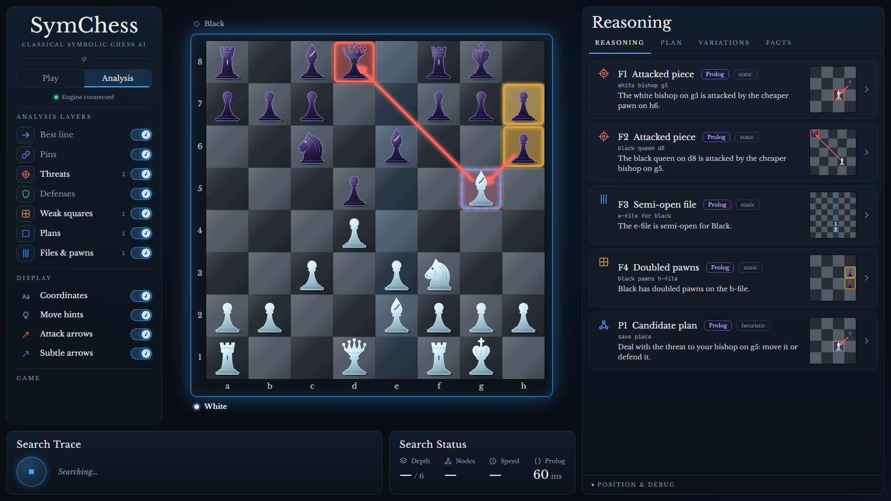

# SymChess

A classical, explainable chess AI in three layers:

- **Common Lisp** (`engine/`) owns the game and the search.
- **Prolog** (`knowledge/`) owns symbolic meaning: pins, forks, weak squares, plans.
- **TypeScript + React** (`web/`) owns the board, the overlays and the reasoning panel.



The design, the reasoning behind it and the measured results are in
[docs/ARCHITECTURE.md](docs/ARCHITECTURE.md).

## Requirements

| Tool | Version used |
|---|---|
| SBCL | 2.6.9 |
| SWI-Prolog | 10.0.2 |
| Node.js | 26.7.0 (Vite 8 needs 20.19+ or 22.12+) |

The engine has no Lisp library dependencies. It looks for `swipl` at
`C:\Program Files\swipl\bin\swipl.exe`, then on `PATH`; set `SYMCHESS_SWIPL`
to override. SBCL's installer does not always add itself to `PATH`; on Windows
it is at `C:\Program Files\Steel Bank Common Lisp\sbcl.exe`.

## Run

Start the engine (it listens on `ws://127.0.0.1:8765`):

```bash
sbcl --script engine/run.lisp
```

Start the UI in a second terminal:

```bash
npm --prefix web install
```

```bash
npm --prefix web run dev
```

Open http://localhost:5173. The page reconnects by itself if the engine is
restarted. If Prolog cannot be started the engine still plays, on search alone,
and the UI says so.

## Difficulty

The engine plays at one of three levels, chosen under **Game** in the left rail. A level is a real engine configuration, not a strong engine told to blunder.

- **Novice**: a 3-ply search with a simple evaluation; picks among the moves it scores close to its best. It never gives a piece away to the next move and never passes up a mate it has seen.
- **Club**: a 6-ply search with the full evaluation.
- **Expert**: searches as deep as its time allows.

Analysis always runs at full strength.

## Guided tour, replay and results

- **Take the one-minute tour** (button under the title, or `?tour=1`): five
  prepared positions, each showing one idea: a pin Prolog found, the search
  confirming and overruling Prolog's suggestions, the engine's line played
  forward, a plan built from a fact, and the three difficulty levels on one
  position. The captions only say what to look at; everything on screen is
  what the engine and Prolog actually answered.
- **Why this move?** After any search, "Step through the line" plays the
  engine's expected line on the board one position at a time, with Prolog's
  facts for each. The engine sends those positions; the page never makes a move
  itself.
- **Measured results** (bottom of the left rail, or `?results=1`): the
  self-play and benchmark figures, including the experiment that showed
  Prolog's hints did not help the search.
- **Motion**: Expressive (strikes, checkmate and promotion effects) or Minimal
  (short glides and fades). Devices that ask for reduced motion get neither.

## Piece styles

The **Pieces** switch in the left rail changes how the game is drawn. It is presentation only; the engine never hears of it.

- **Classic**: glass chess pieces on a flat board.
- **Figures**: the same glass, drawn as statues (soldier, cleric, tower, horse, queen, king).
- **3D**: a 3D board of statues that fight when one takes another. Click to move. The analysis overlays, keyboard play and drag are only on the flat boards. Three.js is fetched only if this is chosen.

Animations are skipped for anyone whose device asks for reduced motion.

## Play it without Vite

`npm --prefix web run build` writes `web/dist`. When that folder exists the
engine serves it itself, so the whole app is one process on one port:
start the engine and open http://127.0.0.1:8765.

## Host it for other people

The engine can run as a small public server: each visitor gets a private
game, and a seat limit keeps a free machine from being overwhelmed.

```bash
docker build -t symchess .
```

```bash
docker run --rm -p 7860:7860 symchess
```

The image defaults to 8 simultaneous players, a 15-minute idle timeout, and a
ceiling of 7 plies / 3 seconds per move. Change them with environment
variables (`SYMCHESS_MAX_SESSIONS`, `SYMCHESS_IDLE_SECONDS`,
`SYMCHESS_MAX_DEPTH`, `SYMCHESS_MAX_MOVE_MS`); the full list is at the top of
`engine/src/server.lisp`.

To publish it for free on Hugging Face Spaces, see the instructions at the top
of [deploy/huggingface/deploy.py](deploy/huggingface/deploy.py).

## Test

```bash
sbcl --script engine/tests/run-tests.lisp
```

```bash
swipl -g run_tests -t halt knowledge/tests/test_knowledge.pl
```

```bash
npm --prefix web test
```

Is a change to the engine an improvement? Play the current engine against the
first one (about five minutes; see the file for other match-ups):

```bash
sbcl --script engine/tests/selfplay.lisp
```

With the engine running, the end-to-end script drives a real session over the
WebSocket and records the engine's messages for the frontend contract test:

```bash
npm --prefix web run e2e
```

Several visitors at once (starts its own engine with two seats; needs a
frontend build, and `SBCL` set if sbcl is not on `PATH`):

```bash
npm --prefix web run sessions
```

Performance, and whether the symbolic layer is helping the search:

```bash
sbcl --script engine/tests/bench.lisp
```

## Layout

```text
engine/      Common Lisp: board, movegen, eval, search, Prolog bridge, WebSocket server
knowledge/   Prolog: attack geometry, tactics, structure, move motifs, plans, rendering
web/         Vite + React + TypeScript frontend
protocol/    Engine messages captured by the e2e script (contract-test fixture)
docs/        Architecture draft
logs/        Per-session event logs and Prolog stderr (git-ignored)
```

## What it does and does not do

- Plays legal chess with iterative-deepening alpha-beta, quiescence, a
  transposition table and standard move ordering. Its playing strength has not
  been measured.
- Explains each engine move with sentences tagged by source (`search`, `eval`,
  `prolog`) and by how far the search backs them up (`measured`, `confirmed`,
  `unconfirmed`, `overruled`, `heuristic`).
- Draws only what the engine or a Prolog fact supplied.
- Prolog's move ranking no longer orders the search: measured over 96 games it
  made play weaker once its time was counted, so it is now shown for comparison
  only. Earlier note, kept for the record:
- Prolog's move-ordering hints are implemented but, measured, do not yet make
  the search smaller (about 0.1% difference). See section 11 of the
  architecture document.
- No opening book, tablebases, PGN, multi-PV or move-list navigation yet.
