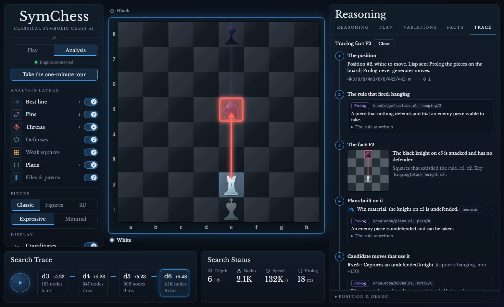
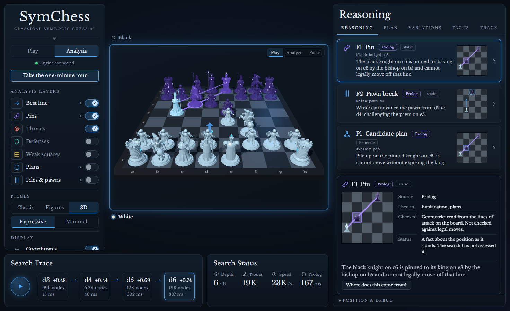

# SymChess

A classical, explainable chess AI in three layers:

- **Common Lisp** (`engine/`) owns the game and the search.
- **Prolog** (`knowledge/`) owns symbolic meaning: pins, forks, weak squares, plans.
- **TypeScript + React** (`web/`) owns the board, the overlays and the reasoning panel.


The design, the reasoning behind it and the measured results are in
[docs/ARCHITECTURE.md](docs/ARCHITECTURE.md).

## What it claims, and what it does not

- **Claims.** The search's sentences are numbers the search returned. Prolog's sentences are a second opinion about the position, each marked with how it stands against what the search found. Tactical facts are measured against hand-labelled positions. Every figure on the results page names the run that produced it.
- **Does not claim.** That Prolog makes the engine play better: measured three ways, it does not. That the latest search changes made it stronger against anything but its own earlier self: there it scored 62.0% over 96 games. That a move the search rates lower is a mistake: it is what a depth-6 search prefers, and the interface says so. Any Elo rating.
- **Limits.** [docs/LIMITATIONS.md](docs/LIMITATIONS.md) lists every known limit and where it stands. [docs/RESEARCH_NOTES.md](docs/RESEARCH_NOTES.md) says what outside practice was checked against.



## Requirements

| Tool | Version used |
|---|---|
| SBCL | 2.6.9 |
| SWI-Prolog | 10.0.2 |
| Node.js | 26.7.0 (Vite 8 needs 20.19+ or 22.12+) |

The engine has no Lisp library dependencies. It looks for `swipl` at
`C:\Program Files\swipl\bin\swipl.exe`, then on `PATH`; set `SYMCHESS_SWIPL`
to override. SBCL's installer does not always add itself to `PATH`; on Windows
it is at `C:\Program Files\Steel Bank Common Lisp\sbcl.exe`.

## Run

Start the engine (it listens on `ws://127.0.0.1:8765`):

```bash
sbcl --script engine/run.lisp
```

Start the UI in a second terminal:

```bash
npm --prefix web install
```

```bash
npm --prefix web run dev
```

Open http://localhost:5173. The page reconnects by itself if the engine is
restarted. If Prolog cannot be started the engine still plays, on search alone,
and the UI says so.

## Difficulty

The engine plays at one of four levels, chosen under **Game** in the left rail. A level is a real engine configuration, not a strong engine told to blunder.

- **Novice**: a 3-ply search with a simple evaluation; picks among the moves it scores close to its best. It never gives a piece away to the next move and never passes up a mate it has seen.
- **Casual**: a 4-ply search with the full evaluation; may settle for a move within a quarter of a pawn of its best.
- **Club**: a 6-ply search with the full evaluation.
- **Expert**: searches as deep as its time allows.

Analysis always runs at full strength.

The steps between levels are steep. In recorded matches of 24 games Casual won every game against Novice and Club won 23 of 24 against Casual. On the hosted site every level is capped at depth 7 and 3 seconds, so Expert plays much like Club there; the level picker says what each level gets on the server you are connected to.

## Guided tour, replay and results

- **Take the one-minute tour** (button under the title, or `?tour=1`): five
  prepared positions, each showing one idea: a pin Prolog found, the search
  confirming and overruling Prolog's suggestions, the engine's line played
  forward, a plan built from a fact, and the three difficulty levels on one
  position. The captions only say what to look at; everything on screen is
  what the engine and Prolog actually answered.
- **Why this move?** After any search, "Step through the line" plays the
  engine's expected line on the board one position at a time, with Prolog's
  facts for each. The engine sends those positions; the page never makes a move
  itself.
- **Measured results** (bottom of the left rail, or `?results=1`): the
  self-play and benchmark figures, including the experiment that showed
  Prolog's hints did not help the search.
- **Motion**: Expressive (strikes, checkmate and promotion effects) or Minimal
  (short glides and fades). Devices that ask for reduced motion get neither.

## Analyse a whole game

**Analyse a game (PGN)** in the left rail takes a pasted game. The engine reads
it, checking every move against its own move generator, then goes through the
game position by position with a short search and Prolog's facts for each. Step
through with the arrow keys; the graph shows the evaluation across the game.

- Comments, side variations and annotation marks are skipped. Only the first
  game in the text is read.
- A move that is not legal stops the reading there. The moves before it are
  kept and the offending move is named.
- At most 400 half-moves are kept.
- The review searches each position to depth 5 or 250 ms, so its scores are
  rough. Use Analysis on a position for a proper search.
- `?review=sample` opens a sample game.

## Why not this move?

In Analysis, the Variations tab has **Why not another move?** Pick any legal
move and the engine searches it and its own choice to the same depth, then
reports:

- both scores, the difference, and a rating of the move from fixed bands;
- the line it expects after each move, and the material count along each;
- what Prolog warned about the move, marked *confirmed* only if the search's
  line really loses the material, *overruled* if the search finds nothing
  wrong;
- which facts the move creates and removes, and which plans lose the facts
  they rested on.

Each statement says where it came from and, where a rule decided its status,
what the rule was. "Step through the line" plays the line after your move on
the board. `&whynot=c4f7` on a position link asks the question directly.

In a game review, every move gets the same comparison at depth 5: the move the
search preferred, how much worse the game move was, and what changed in the
evaluation and in Prolog's facts. Moves the search rates a missed chance,
mistake or blunder are marked in the move list.

Two cautions. The ratings are the search's opinion at a shallow depth: it
calls some sound moves inaccurate and misjudges sacrifices that pay off later
(it marks Morphy's 10.Nxb5 in the sample game). And a small difference means
nothing; only the larger bands are worth attention.

## Follow a claim back

In Analysis, the **Trace** tab is a debugger for the reasoning. Pick a fact, a
plan or any sentence of an explanation and it lays out, in order:

1. the position Prolog was shown;
2. the rule that fired, quoted from its Prolog source file with the comment
   above it;
3. the fact and the squares that satisfied the rule;
4. the plans that cite the fact;
5. the candidate moves whose motifs Prolog says rest on it;
6. what a search said about any of those, the number behind the status, and
   the check that turned that number into "confirmed" or "overruled".

Every link is one the engine or Prolog sent. A step with nothing behind it
says so ("no plan cites this fact", "the search has not assessed it") and is
not filled in by guessing.

Below the chain, **Where Prolog and the search differ** lists every sentence of
Prolog's that the search overruled or left unconfirmed, with counts, and says
whether Prolog's top-ranked move was the move the search chose. **All rules**
lists the whole index: 53 Prolog rules and 18 measurements and checks on the
Lisp side.

`&trace=pin` on a position link opens the first fact of that kind in the Trace
tab.

## Use it from a chess program (UCI)

```bash
sbcl --script engine/uci.lisp
```

Point any program that speaks the Universal Chess Interface (Arena, Cute Chess,
Banksia) at that command. Supported: `uci`, `isready`, `ucinewgame`,
`position`, `go depth N`, `go movetime N`, `go infinite`, `stop`, `quit`.

Limits, stated plainly: no options, no pondering, no opening book, and no real
time management (with `wtime`/`btime` it simply spends a thirtieth of the
clock). The Prolog layer is not used here: UCI has no place to put an
explanation.

## Piece styles

The **Pieces** switch in the left rail changes how the game is drawn. It is presentation only; the engine never hears of it.

- **Classic**: glass chess pieces on a flat board.
- **Figures**: the same glass, drawn as statues (soldier, cleric, tower, horse, queen, king).
- **3D**: a 3D board of carved statues (foot soldier, knight on a rearing horse, bishop with crozier, stone tower, warrior queen, king on his sword) that fight when one takes another. The shapes are built in code from simple solids, in the same ice and amethyst glass; see `docs/screenshots/statues.png`. Click to move. In analysis it shows the fact or plan selected in the panel (its arrows, rings and squares, with the pieces it names lit), the search's best move, and coordinates on the rim, with three camera presets: Play, Analyze and Focus. The standing analysis layers, keyboard play and drag are only on the flat boards, which remain the precise workbench. Three.js is fetched only if this is chosen.



Animations are skipped for anyone whose device asks for reduced motion.

## Play it without Vite

`npm --prefix web run build` writes `web/dist`. When that folder exists the
engine serves it itself, so the whole app is one process on one port:
start the engine and open http://127.0.0.1:8765.

## Host it for other people

The engine can run as a small public server: each visitor gets a private
game, and a seat limit keeps a free machine from being overwhelmed.

```bash
docker build -t symchess .
```

```bash
docker run --rm -p 7860:7860 symchess
```

The image defaults to 8 simultaneous players, a 15-minute idle timeout, and a
ceiling of 7 plies / 3 seconds per move. Change them with environment
variables (`SYMCHESS_MAX_SESSIONS`, `SYMCHESS_IDLE_SECONDS`,
`SYMCHESS_MAX_DEPTH`, `SYMCHESS_MAX_MOVE_MS`); the full list is at the top of
`engine/src/server.lisp`.

To publish it for free on Hugging Face Spaces, see the instructions at the top
of [deploy/huggingface/deploy.py](deploy/huggingface/deploy.py).

## Test

```bash
sbcl --script engine/tests/run-tests.lisp
```

```bash
swipl -g run_tests -t halt knowledge/tests/test_knowledge.pl
```

```bash
npm --prefix web test
```

Are the explanations right? Sixty-six positions with hand-written answers check
the tactical facts Prolog reports, the move the search plays, and the status
the explanation gives each idea, each scored separately. The method, results
and known misses are in [docs/ANALYSIS_CREDIBILITY.md](docs/ANALYSIS_CREDIBILITY.md).

```bash
sbcl --script engine/tests/credibility.lisp
```

Is a change to the engine an improvement? One runner measures every named
configuration (the first engine, each feature alone, everything on, everything
on with Prolog's hints) and writes what it found to `results/`, with the date,
machine, commit, a fingerprint of the sources, and the command. About a minute:

```bash
sbcl --script engine/tests/experiment.lisp
```

Seven self-play matches of 24 games each, about half an hour:

```bash
sbcl --script engine/tests/experiment.lisp matches
```

One match-up by itself, printed and not recorded (about five minutes; see the
file for the names):

```bash
sbcl --script engine/tests/selfplay.lisp
```

The difficulty levels against each other, about half an hour:

```bash
sbcl --script engine/tests/experiment.lisp ladder
```

Were the recorded files made by the sources as they are now?

```bash
sbcl --script engine/tests/experiment.lisp verify
```

The results page in the app is built from those files. `credibility.lisp`
above records its run the same way. Set `SYMCHESS_RUN_NOTE` to put a note
about the conditions (what else the machine was doing) into a recorded file.

Screenshots of the main views, with the engine and the dev server running:

```bash
npm --prefix web run screenshots
```

With the engine running, the end-to-end script drives a real session over the
WebSocket and records the engine's messages for the frontend contract test:

```bash
npm --prefix web run e2e
```

Several visitors at once (starts its own engine with two seats; needs a
frontend build, and `SBCL` set if sbcl is not on `PATH`):

```bash
npm --prefix web run sessions
```

Performance, and whether the symbolic layer is helping the search:

```bash
sbcl --script engine/tests/bench.lisp
```

## Layout

```text
engine/      Common Lisp: board, movegen, eval, search, Prolog bridge, WebSocket server
knowledge/   Prolog: attack geometry, tactics, structure, move motifs, plans, rendering
web/         Vite + React + TypeScript frontend
protocol/    Engine messages captured by the e2e script (contract-test fixture)
results/     Recorded runs of the measuring scripts; the results page reads these
docs/        Architecture draft
logs/        Per-session event logs and Prolog stderr (git-ignored)
```

## What it does and does not do

- Plays legal chess with iterative-deepening alpha-beta (null-move and reverse
  futility pruning, late move reductions), a quiescence search that answers
  checks, a transposition table and standard move ordering. Its playing
  strength has been measured only against earlier versions of itself.
- Explains each engine move with sentences tagged by source (`search`, `eval`,
  `prolog`) and by how far the search backs them up (`measured`, `confirmed`,
  `unconfirmed`, `overruled`, `heuristic`).
- Draws only what the engine or a Prolog fact supplied.
- Prolog's move ranking no longer orders the search: measured over 96 games it
  made play weaker once its time was counted, so it is now shown for comparison
  only. Earlier note, kept for the record:
- Prolog's move-ordering hints are implemented but, measured, do not yet make
  the search smaller (about 0.1% difference). See section 11 of the
  architecture document.
- No opening book, tablebases, PGN, multi-PV or move-list navigation yet.
